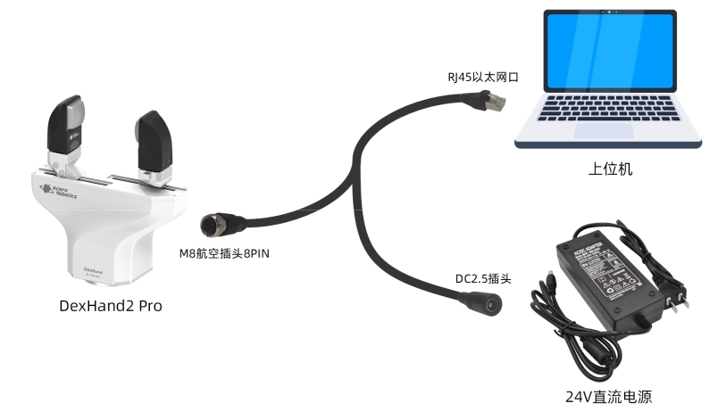
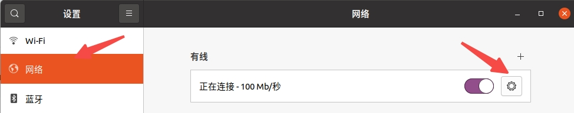
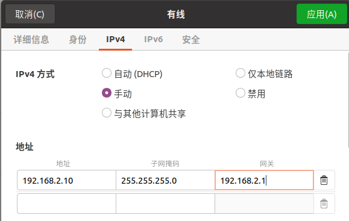
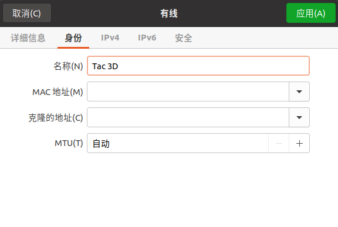

# Dexhand 2 Pro (Python)
## Documents
see more details in `1 DexHand2 Pro 机械手产品规格书-v1.0.pdf` and `2 DexHand2 Pro SDK二次开发手册-v1.1.pdf`

## network connection


机械手的 IP 地址: `192.168.2.100`，port: `60031`，子网掩码: `255.255.255.0`，

PC IP 设置：`192.168.2.x`网段, eg: `192.168.2.10`

点击`设置/网络`，在有线里点击



在`IPv4`里手动设置ip地址和名称




设置完成后点击`应用`

## 1. conda setting
```
conda create -n dexhand python=3.8
```
## 2. git clone
```
mkdir ~/Tac_3D && cd ~/Tac_3D
git clone https://github.com/ChangerC77/Tac-3D.git
```

## 3. environment setting
```
cd ~/Tac\ 3D/DexHand-SDK-v1.1/pyDexHandClient
pip install .
```
## Usage
### 1. activate the hand
```
python ~/Tac\ 3D/DexHand-SDK-v1.1/pyDexHandClient/examples/activate_service.py 
```
#### start_server
```
from dexhand_client import DexHandClient

client = DexHandClient(ip="192.168.2.100", port=60031)
client.start_server() # 开启服务端例程
```
### 2. get information about the hand and tactile
```
python ~/Tac\ 3D/DexHand-SDK-v1.1/pyDexHandClient/control/get_info.py
```
#### hand_info
```
client.hand_info # 获取本体信息
```
### 3. move dexhand
```
python ~/Tac\ 3D/DexHand-SDK-v1.1/pyDexHandClient/examples/move_dexhand.py
```
```
client.acquire_hand() # 获取 DexHand 的控制权 

client.set_home() # 回到零点（最大开合位置）
client.pos_goto(goal_pos=30, max_speed=40, max_acc=20, max_f=3) # 位置控制
client.pos_servo(goal_pos=10, max_f=3) # pos_servo 允许用户在 DexHand 尚未到达指定位置时更改目标位置。
sleep(2)

client.release_hand() # 释放 DexHand 的控制权 
```
### 4. dexhand force control
```
python ~/Tac\ 3D/DexHand-SDK-v1.1/pyDexHandClient/examples/grasp_force_control.py
```
```
client.calibrate_force_zero() # 力校准零点
client.contact(contact_speed=8, preload_force=2, quick_move_speed=15, quick_move_pos=10)
client.grasp(goal_force=10.0, load_time=5.0)
client.force_servo(goal_force=1.0) # 力控
```
#### contact
```
client.contact(contact_speed=8, preload_force=2, quick_move_speed=15, quick_move_pos=10) 
```
contact 函数将以给定的速度闭合 DexHand 夹爪， 并在接触到物体后施加指定的预载力。需要特别说明的是，如果预先知道某一个位置一定不 会接触上物体，则通过 contact 函数可以先控制 DexHand 快速运动至该位置，再进行上述 接触过程。 


#### grasp  &  force_servo 
```
# 保证在力控前已经接触上物体! 
client.grasp(goal_force=5.0,load_time=1.0) # 抓取力到达 5N 时返回 
client.force_servo(goal_force=6.0) # 确认服务端收到后即刻返回 
```


### 5. dexhand 与 tac 3D 联合使用
`ATTENTION`: 这里使用前要先修改代码里视触觉传感器的型号，这里要把`Tac3D_name1`和`Tac3D_name2`改为自己的设备型号，本设备测试型号具体见下文`Tac 3D 1.hardware`部分
```
# 创建传感器数据存储实例
Tac3D_name1 = "HDL1-0003"# 注意，'HDL1-0001'仅是举例，用户使用时请改成DexHand机械手上实际的Tac3D传感器编号
Tac3D_name2 = "HDL1-0004"# 注意，'HDL1-0002'仅是举例，用户使用时请改成DexHand机械手上实际的Tac3D传感器编号
```
```
python ~/Tac\ 3D/DexHand-SDK-v1.1/pyDexHandClient/examples/handandtac3d.py
```

### 6. clear the error
```
python ~/Tac\ 3D/DexHand-SDK-v1.1/pyDexHandClient/control safe.py
```
# Tac 3D 
## Documents
see more details in `3 Tac3D AD2 触觉传感器产品规格书-v1.3.2.pdf`, `4 Tac3D AD2 SDK二次开发手册-v1.3.2.pdf` and `5 Tac3D Desktop 2024b 操作手册-v1.3.1.pdf`

## 1. Hardware


## 2. Environment Setting
### 1.  install dependence
```
pip install numpy ruamel.yaml vedo==2023.4.6 vtk==9.1.0  # 视触觉传感器要用的库
```
### 2.2 check the version
```
pip list | grep vedo
pip list | grep vtk
```
output
```
vedo                          2023.4.6
vtk                           9.4.1
```
## 3. Usage
### 1. example
```
python ~/Tac\ 3D/Tac3D-SDK-v3.2.1/Tac3D-API/python/PyTac3D/main-example.py
```
### 2. GUI
#### configuration setup
`ATTENTION`: 使用前要将视触觉传感器型号改为我们使用的型号
```
self.Tac3D_name1 = "HDL1-0003"# 注意，'HDL1-0001'仅是举例，用户使用时请改成DexHand机械手上实际的Tac3D传感器编号
self.Tac3D_name2 = "HDL1-0004"# 注意，'HDL1-0002'仅是举例，用户使用时请改成DexHand机械手上实际的Tac3D传感器编号
```
#### 启动
```
python ~/Tac\ 3D/Tac3D-SDK-v3.2.1/Tac3D-API/python/PyTac3D/PyTac3D_Displayer.py
```

### 3. 同时显示2个传感器的GUI界面
#### configuration setup
`ATTENTION`: 使用前要将视触觉传感器型号改为我们使用的型号
```
self.Tac3D_name1 = "HDL1-0003"
self.Tac3D_name2 = "HDL1-0004"

if SN=="HDL1-0003":
    self.frameCacheLeft[recvTimestamp] = frame

# 处理左手数据 (窗口 0, 2)
if L_left is not None:
    meshSize = mesh_table[getModelName("HDL1-0003")]

# 处理右手数据 (窗口 1, 3)
if L_right is not None:
    meshSize = mesh_table[getModelName("HDL1-0004")]
```
#### 启动
```
python ~/Tac\ 3D/Tac3D-SDK-v3.2.1/Tac3D-API/python/PyTac3D/PyTac3D_2_GUI.py
```

# bug
## 1. vedo 和 vtk 版本兼容问题
```
Traceback (most recent call last):
 File "/home/robotics/Tac 3D/Tac3D-SDK-v3.2.1/Tac3D-API/python/PyTac3D/PyTac3D_Displayer.py", line 152, in <module>
 displayer = Tac3D_Displayer(port)
 File "/home/robotics/Tac 3D/Tac3D-SDK-v3.2.1/Tac3D-API/python/PyTac3D/PyTac3D_Displayer.py", line 19, in init
 self._axs = vedo.Axes(self._box, c='k', xygrid=False)  # returns an Assembly object
 File "/home/robotics/miniconda3/envs/manipulation/lib/python3.9/site-packages/vedo/addons.py", line 3087, in Axes
 axlinex = shapes.Line([0,0,0], [dx,0,0], c=xline_color, lw=axes_linewidth)
 File "/home/robotics/miniconda3/envs/manipulation/lib/python3.9/site-packages/vedo/shapes.py", line 440, in init
 self.center = []
 AttributeError: attribute 'center' of 'vtkmodules.vtkRenderingCore.vtkProp3D' objects is not writable
 ```
 solution see in `Tac 3D 1. install dependence`